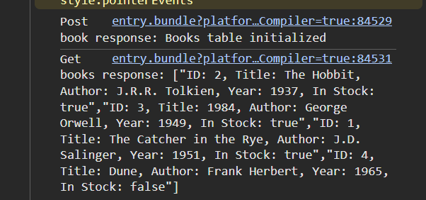

# Bin.it-Game
An interactive game to help people learn about waste disposal.

## Dependencies:
- [JDK 21](https://www.oracle.com/ca-en/java/technologies/downloads/#java21) or greater Added to JAVA_HOME Environment variable
- [Maven](https://maven.apache.org/download.cgi) (Add bin to PATH Environment Variable) or use Chocolatey if installed;
- `choco install maven`
- [Node.JS (LTS)](https://nodejs.org/en/download) 
- May need to run `mvn clean compile` for backend initialization
- May need to run `npm install` and `npm run start` for frontend initialization
- 
- Need to install `create-expo-app@3.5.3` package if not automatically installed
- May need to install `npx expo install expo-dev-client`
- Install [Java Extension Pack](https://marketplace.visualstudio.com/items?itemName=vscjava.vscode-java-pack)

## Setup:
- Need to create .env file in root `Bin.it-Game/` directory with neon credentials to establish neon database connection
- Run `Bin.it-Game\Bin-It\src\main\java\com\project\Bin_It\BinItApplication.java` in vscode
- Run `npx expo start` to test expo app (run on expo go) and open console log to see successful post and get requests to neonDB: 
